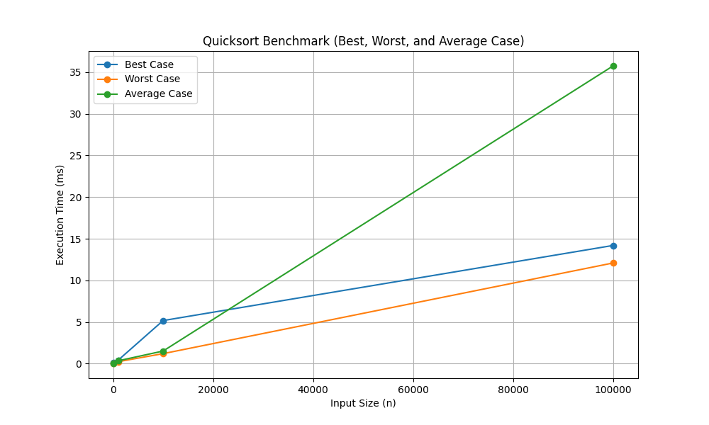

# Hands on 6

## 1. Implement both versions of quicksort (random and non-random choice for the pivot) and share the GitHub repository with your source code.
  ```js
function quicksortRandom(arr: number[]): number[] {
    if (arr.length <= 1) return arr;

    const pivot = arr[Math.floor(Math.random() * arr.length)];
    const left = arr.filter((x) => x < pivot);
    const middle = arr.filter((x) => x === pivot);
    const right = arr.filter((x) => x > pivot);

    return [...quicksortRandom(left), ...middle, ...quicksortRandom(right)];
}

function quicksort(arr: number[]): number[] {
    if (arr.length <= 1) return arr;

    const pivot = arr[Math.floor(arr.length / 2)];
    const left = arr.filter((x) => x < pivot);
    const middle = arr.filter((x) => x === pivot);
    const right = arr.filter((x) => x > pivot);

    return [...quicksort(left), ...middle, ...quicksort(right)];
}
  ```
## 2.  For the non-random pivot version of quicksort show the following benchmarks on the same graph:

    2a) best case (generate a set of inputs that will always be the best case, repeat for multiple array input sizes "n").

    2b) worst case (generate a set of inputs that will always be the worst case, repeat for multiple array input sizes "n").

    2c) average case (generate a set of inputs from a uniform distribution, repeat for multiple array input sizes "n").
```js
  function generateSortedArray(n: number): number[] {
    return Array.from({ length: n }, (_, i) => i);
}

function generateReverseSortedArray(n: number): number[] {
    return Array.from({ length: n }, (_, i) => n - i);
}

function generateRandomArray(n: number): number[] {
    return Array.from({ length: n }, () => Math.floor(Math.random() * n));
}

function benchmarkQuickSort() {
    const sizes = [100, 1000, 10000, 100000];
    const results = {
        Best: [] as number[],
        Worst: [] as number[],
        Average: [] as number[],
        Sizes: sizes
    };

    sizes.forEach((n) => {
        const sortedArray = generateSortedArray(n);
        const reverseSortedArray = generateReverseSortedArray(n);
        const randomArray = generateRandomArray(n);

        // Best case (already sorted)
        const startBest = performance.now();
        quicksort([...sortedArray]);
        const endBest = performance.now();
        results.Best.push(endBest - startBest);
        console.log(`Best Case (n=${n}): ${endBest - startBest}ms`);

        // Worst case (reverse sorted)
        const startWorst = performance.now();
        quicksort([...reverseSortedArray]);
        const endWorst = performance.now();
        results.Worst.push(endWorst - startWorst);
        console.log(`Worst Case (n=${n}): ${endWorst - startWorst}ms`);

        // Average case (random)
        const startAvg = performance.now();
        quicksort([...randomArray]);
        const endAvg = performance.now();
        results.Average.push(endAvg - startAvg);
        console.log(`Average Case (n=${n}): ${endAvg - startAvg}ms`);
    });

    return results;
}


  const benchmarkResults = benchmarkQuickSort();

  //result obtained from running code locally
  /*
  Best Case (n=100): 0.08283299999999372ms
  Worst Case (n=100): 0.037332999999989624ms
  Average Case (n=100): 0.05020799999999781ms
  Best Case (n=1000): 0.4142089999999996ms
  Worst Case (n=1000): 0.2400829999999985ms
  Average Case (n=1000): 0.34575000000000955ms
  Best Case (n=10000): 5.17658400000002ms
  Worst Case (n=10000): 1.204499999999996ms
  Average Case (n=10000): 1.5180409999999824ms
  Best Case (n=100000): 14.19545800000003ms
  Worst Case (n=100000): 12.092624999999998ms
  Average Case (n=100000): 35.753916000000004ms*/
```



## 3. Mathematically derive the average runtime complexity of the non-random pivot version of quicksort.

Let T(n) be the time complexity to sort an array of size nn using quicksort. In each step of quicksort, the algorithm chooses a pivot element and partitions the array into two subarrays:

-  One subarray contains elements smaller than the pivot.
-  The other subarray contains elements greater than the pivot.

The partition step takes linear time, i.e., O(n).

If we assume that the input array is a random permutation of the data, the pivot will divide the array into two subarrays of expected sizes close to (n/2​), though the exact sizes vary depending on the pivot selection. Therefore, we need to derive a recurrence relation for the expected time complexity.

2. Recurrence Relation for Expected Time Complexity

At each step, the time complexity of quicksort can be expressed as:
T(n)=T(size of left subarray)+T(size of right subarray)+cost of partitioning

On average, the pivot splits the array into two subarrays of approximately equal size (i.e., n/2​). Therefore, the recurrence relation for the expected time complexity can be written as:
T(n)=T(n/2)+T(n/2)+n

This can be simplified to:
T(n)=2T(2n​)+n

3. Solving the Recurrence Relation

- At the first level, the cost is T(n)=n.
- At the second level, the cost is 2T(2n​)=2⋅2n​=n.
- At the third level, the cost is 4T(4n​)=4⋅4n​=n.

This pattern continues until we reach subarrays of size 1. The recurrence can be expanded as follows:
T(n)=n+n+n+⋯+n(log n terms)

Therefore
T(n)=nlogn

So average case is 
T(n)=O(nlogn)


Relavant code is given in the root folder.
